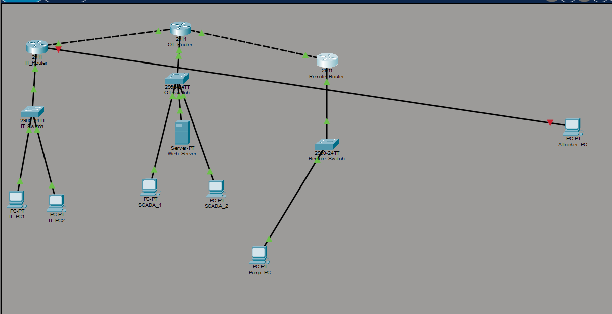
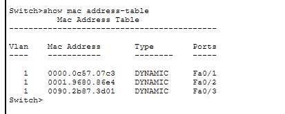
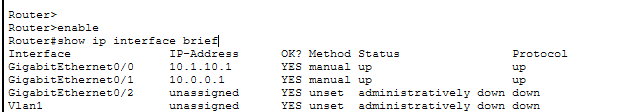
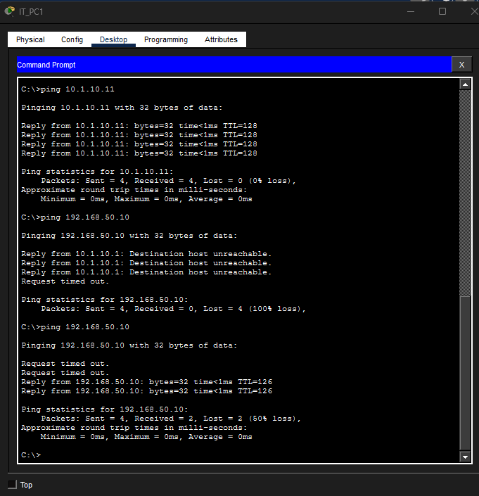
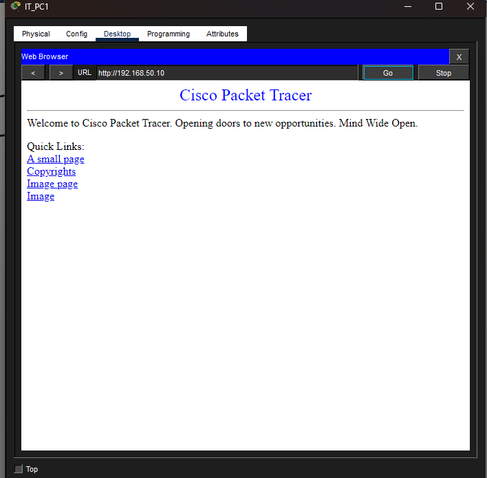
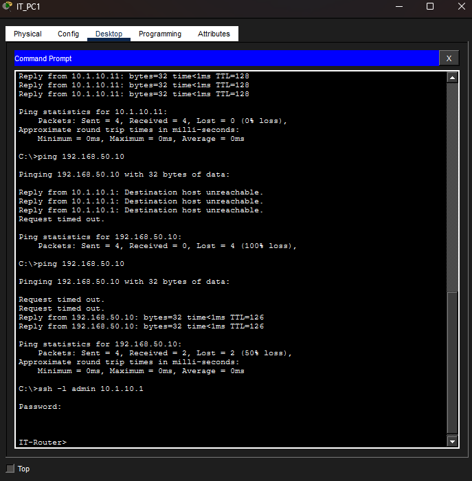

# Lab 04 – Enterprise LAN Security Assessment

## Andre Sheppard  
IT 335-A  
April 1, 2026  

---

## Part 1 – Network Architecture

### Layer 1 – Physical Layer
The Physical Layer includes cables, ports, and signals that transmit raw bits between devices.

---

### Layer 2 – Data Link Layer
The Data Link Layer uses MAC addresses to identify devices on a local network. Switches learn MAC addresses and forward frames to the correct port.

---

### Layer 3 – Network Layer
The Network Layer uses IP addresses and routing to move packets between different networks.

---

## Part 2 – Protocol Security

### TCP vs UDP
TCP uses a three-way handshake (SYN, SYN-ACK, ACK) to establish a reliable and stateful connection. UDP is connectionless and faster but less secure.

### HTTP vs HTTPS
HTTP sends data in cleartext, making it vulnerable to interception. HTTPS uses TLS/SSL encryption to protect data.

(https.png)

### SSH vs Telnet
Telnet sends credentials in cleartext, while SSH encrypts all communication.

---

## Part 3 – Shellshock Analysis
Shellshock allows remote code execution by exploiting Bash environment variables.

---

## Part 4 – Incident Response
- Patch systems  
- Segment networks  
- Implement monitoring  

---

## Reflection
This lab demonstrated how network design and security are closely connected.